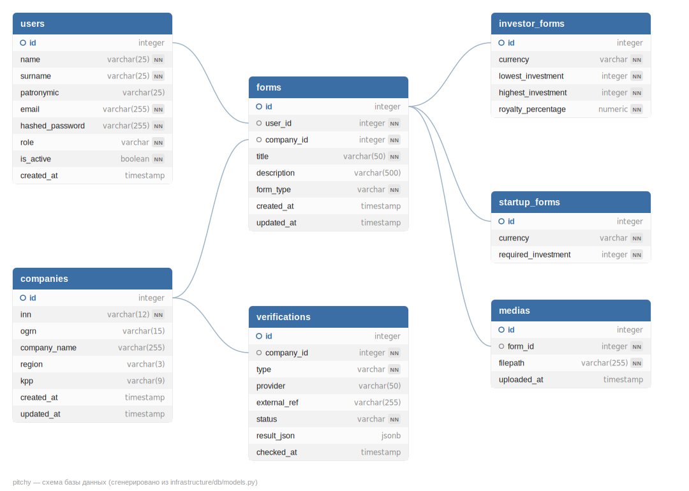

# Pitchy

Backend-платформа для поиска стартапами инвесторов и инвесторами — стартапов. Пользователь создаёт профиль-анкету (форму): указывает, кто он — инвестор или стартап, — и заполняет условия (диапазон и валюта инвестиций, процент роялти для инвестора; требуемая сумма для стартапа), прикладывает фото/видео и привязывает анкету к юридическому лицу (компании), которое проходит автоматическую проверку по открытым реестрам (ЕГРЮЛ/ЕГРИП, ФССП).

Проект написан на **FastAPI** с асинхронным **SQLAlchemy 2.0 / PostgreSQL**, файлы анкет хранятся в **S3-совместимом** объектном хранилище (MinIO), авторизация — **JWT (RS256)** с access/refresh токенами.

## Стек

| Компонент | Технология |
|---|---|
| API-фреймворк | FastAPI + Uvicorn |
| БД | PostgreSQL, SQLAlchemy 2.0 (async, `asyncpg`), Alembic (миграции) |
| Хранилище файлов | MinIO (S3 API, `aiobotocore`) |
| Авторизация | JWT RS256 (`PyJWT`), пароли — `bcrypt` |
| Внешние проверки | DaData (ЕГРЮЛ/ЕГРИП по ИНН), DaMIA (ФССП/исполнительные производства) |
| Инфраструктура | Docker Compose (Postgres + MinIO) |

Автоматическая документация API доступна после запуска на `/api/v1/docs` (Swagger UI) и `/api/v1/redoc` (Redoc).

## Схема базы данных



> Диаграмма сгенерирована на основе актуальных ORM-моделей (`src/infrastructure/db/models.py`), а не нарисована вручную, так что она гарантированно соответствует коду.

Таблицы:

- **users** — аккаунты пользователей (email/пароль, роль `User`/`Admin`, мягкое удаление через `is_active`).
- **companies** — юридические лица (ИНН, ОГРН, КПП, название, регион), к которым привязываются анкеты; данные дозаполняются автоматически по результатам проверки ЕГРЮЛ.
- **forms** — анкета: заголовок, описание, тип (`investor` | `startup`), ссылки на автора (`user_id`) и компанию (`company_id`).
- **investor_forms** — детали анкеты инвестора (1:1 с `forms`, тот же `id`): валюта, диапазон суммы инвестиций, процент роялти.
- **startup_forms** — детали анкеты стартапа (1:1 с `forms`, тот же `id`): валюта, требуемая сумма.
- **medias** — фото/видео, прикреплённые к анкете (до 10 файлов на анкету), хранится ссылка на объект в MinIO.
- **verifications** — результаты проверки **компании** по внешним источникам (ЕГРЮЛ/ЕГРИП, ФССП), с кэшированием по паре `(company_id, type)` — статус `pending | verified | flagged | failed`.

## API

Базовый префикс всех маршрутов — `/api/v1`.

### Auth (без дополнительного префикса)

| Метод | Путь | Авторизация | Описание |
|---|---|---|---|
| POST | `/login` | нет / опционально Bearer | Вход по email + паролю |
| POST | `/refresh` | refresh-cookie | Обновление access-токена |
| GET | `/user-credentials` | Bearer (обязательно) | Данные текущего пользователя |
| POST | `/logout` | нет | Выход (удаление refresh-cookie) |

Детали:
- Токены — RS256 JWT: **access** живёт 15 минут и возвращается в теле ответа, **refresh** — 30 дней и кладётся в httpOnly-cookie `refresh_token` (флаг `Secure` управляется `REFRESH_COOKIE_SECURE`). Payload содержит `sub` (email) и `type` (`access`/`refresh`).
- `/login` дополнительно проверяет уже переданный Bearer-токен: если он принадлежит обычному (не `Admin`) уже авторизованному пользователю — вернётся `403 User is already authorized`; анонимный запрос или запрос от имени `Admin` авторизацию проходит.
- `/refresh` не ротирует refresh-токен — только выпускает новый access по валидному refresh из cookie.
- `/logout` **не** инвалидирует уже выданный access-токен (JWT stateless) — он просто истечёт по времени; удаляется только refresh-cookie.

### Users — `/users`

| Метод | Путь | Авторизация | Описание |
|---|---|---|---|
| GET | `/` | нет | Список всех активных пользователей |
| GET | `/{user_id}` | нет | Профиль пользователя (только активный, иначе 404) |
| POST | `/create_user` | нет / опционально Bearer | Регистрация нового пользователя |
| POST | `/create_superuser` | Bearer, только `Admin` | Создание пользователя с произвольной ролью |
| PATCH | `/me/edit` | Bearer | Редактирование своего профиля (имя/фамилия/отчество) |
| PATCH | `/{user_id}/edit` | Bearer, только `Admin` | Редактирование чужого профиля, включая роль |
| PATCH | `/{user_id}/restore-deleted-account` | Bearer, только `Admin` | Восстановление мягко удалённого аккаунта |
| DELETE | `/me/delete-account` | Bearer | Мягкое удаление своего аккаунта |
| DELETE | `/{user_id}/delete-account` | Bearer, себя или `Admin` | Мягкое удаление (`is_active = false`) |
| DELETE | `/{user_id}/hard-delete-account` | Bearer, только `Admin` | Безвозвратное удаление (каскадно удаляет анкеты пользователя) |

Детали:
- `POST /create_user` принимает `multipart/form-data`, проверяет совпадение `password`/`password_confirm` (`422` при расхождении) и уникальность email (`409`). Если запрос анонимный — пользователь создаётся с ролью `User`, и в ответе сразу выдаётся пара токенов (авто-логин после регистрации). Если запрос выполнен от имени `Admin` — пользователь создаётся без выдачи токенов. Если запрос выполнен от имени уже авторизованного не-администратора — `403` (`"Log out to create a new account"`).
- Первого администратора самостоятельно создать через API нельзя (`create_superuser` требует уже существующего `Admin`) — см. раздел «Локальный запуск», шаг про создание администратора вручную в БД.
- Мягкое удаление (`is_active = false`) блокирует логин (`show_profile_by_email` вернёт `403 Account is deactivated`), но не удаляет данные — это делает только `hard-delete-account`.

### Forms — `/forms`

| Метод | Путь | Авторизация | Описание |
|---|---|---|---|
| GET | `/` | нет | Список анкет активных пользователей |
| GET | `/{form_id}` | нет | Анкета по id |
| GET | `/user/{user_id}` | нет | Все анкеты пользователя |
| POST | `/create` | нет* | Создать базовую анкету (заголовок, описание, тип, привязка к компании) |
| POST | `/create/investor` | нет* | Добавить к анкете блок «инвестор» |
| POST | `/create/startup` | нет* | Добавить к анкете блок «стартап» |
| PUT | `/{form_id}/edit` | нет* | Изменить базовые поля анкеты |
| PUT | `/{form_id}/edit/investor` | нет* | Изменить блок «инвестор» |
| PUT | `/{form_id}/edit/startup` | нет* | Изменить блок «стартап» |
| DELETE | `/{form_id}/delete` | нет* | Удалить анкету |
| POST | `/{form_id}/media` | нет* | Прикрепить до 10 фото/видео к анкете |
| DELETE | `/{form_id}/media` | нет* | Удалить все медиафайлы анкеты |

`*` — эти маршруты не используют JWT-зависимость напрямую: `user_id` передаётся полем формы (`multipart/form-data`), а сервис лишь сверяет, что `form.user_id` совпадает с переданным `user_id` (иначе `403`). Это важно учитывать при интеграции — маршруты полагаются на переданный `user_id`, а не на данные из токена.

Детали:
- Анкета (`forms`) — это «обёртка» с заголовком/описанием/типом (`investor`/`startup`) и обязательной привязкой к существующей компании (`404`, если `company_id` не найден).
- Детали (`investor_forms`/`startup_forms`) — это связь 1:1 с `forms` (тот же первичный ключ), создаются/редактируются отдельными запросами уже после создания базовой анкеты.
- Удаление анкеты (`DELETE /{form_id}/delete`) разрешено владельцу либо пользователю с ролью `Admin`; каскадно удаляются связанные `investor_forms`/`startup_forms`/`medias`.
- Медиа: принимаются только файлы с `Content-Type` вида `image/*` или `video/*`, пустые файлы отклоняются; лимит — 10 файлов на анкету суммарно (проверяется и при добавлении новой пачки файлов). Файлы загружаются в MinIO по пути `development/forms/{form_id}/{uuid}.{ext}`. Удаление медиа лучшим образом (best-effort) чистит и объекты в MinIO — ошибка S3 при удалении не прерывает операцию.

### Verifications — `/verifications`

| Метод | Путь | Авторизация | Описание |
|---|---|---|---|
| POST | `/egrul` | нет | Проверить компанию по ИНН через ЕГРЮЛ/ЕГРИП (DaData) |
| POST | `/{company_id}/fssp` | нет | Проверить компанию по ФССП (DaMIA) |

Детали:
- Проверка привязана не к анкете, а к **компании** — так несколько анкет разных пользователей, ссылающихся на одну компанию, переиспользуют один и тот же результат проверки (уникальный индекс `(company_id, type)`).
- `POST /egrul`: если компании с таким ИНН ещё нет — она создаётся; данные (`ogrn`, `kpp`, `company_name`, `region`) дозаполняются из ответа DaData. Статус: `verified`, если статус лица `ACTIVE`, иначе `flagged`; `failed`, если по ИНН ничего не найдено.
- `POST /{company_id}/fssp`: компания должна уже существовать (`404` иначе); статус `flagged`, если найдено хотя бы одно незавершённое исполнительное производство, иначе `verified`.
- Гонки при одновременном создании компании/записи проверки с одинаковым ключом обрабатываются через `SAVEPOINT` + перехват `IntegrityError` — на конкурентный запрос с тем же ИНН/типом ошибка не возвращается, оба запроса получат одну и ту же запись.

## Переменные окружения

Все переменные и моковые значения для локальной разработки перечислены в [`.env.example`](.env.example) — скопируйте его в `.env`:

```bash
cp .env.example .env
```

Коротко по блокам:

| Блок | Назначение |
|---|---|
| `DB_*` | Подключение приложения к PostgreSQL |
| `DB_MIGRATION_*` | Пользователь, под которым поднимается контейнер Postgres и накатываются миграции |
| `DB_TEST_*`, `TEST_MODE` | Зарезервировано под тестовую БД (пока не используется кодом) |
| `PASSPHRASE`, `REFRESH_COOKIE_SECURE` | Настройки JWT/cookie |
| `MINIO_*`, `S3_*` | Доступ к MinIO (S3 API) для хранения медиафайлов |
| `DADATA_API_KEY`, `DAMIA_API_KEY` | Ключи внешних API проверки контрагентов |

## Локальный запуск

Инструкция разворачивает окружение полностью локально: инфраструктура (PostgreSQL, MinIO) — в Docker, само приложение — на хосте через виртуальное окружение Python. Docker-образа для самого API в проекте нет.

### 0. Требования

- Python 3.11+ (в проекте используется venv на Python 3.14)
- Docker и Docker Compose
- OpenSSL (для генерации ключей JWT)

### 1. Клонирование и окружение Python

```bash
git clone <URL_репозитория>
cd pitchy

python3 -m venv venv
source venv/bin/activate        # Windows: venv\Scripts\activate

pip install -r requirements.txt
```

### 2. Переменные окружения

```bash
cp .env.example .env
```

Моковых значений из `.env.example` достаточно, чтобы поднять проект локально «из коробки». Ключи `DADATA_API_KEY`/`DAMIA_API_KEY` нужны только для роутов `/api/v1/verifications/*` — если проверка контрагентов не нужна прямо сейчас, оставьте плейсхолдеры как есть, остальной функционал (пользователи, анкеты, медиа) будет работать.

### 3. RSA-ключи для JWT

Каталог `certs/` в git не хранится (см. `.gitignore`), его нужно создать один раз локально:

```bash
mkdir -p certs
openssl genrsa -out certs/private.pem 2048
openssl rsa -in certs/private.pem -pubout -out certs/public.pem
```

Если хотите защитить приватный ключ паролем — сгенерируйте его с `-aes256` и укажите тот же пароль в `PASSPHRASE` внутри `.env`:

```bash
openssl genrsa -aes256 -out certs/private.pem 2048
openssl rsa -in certs/private.pem -pubout -out certs/public.pem
```

### 4. Инфраструктура (PostgreSQL + MinIO)

```bash
docker compose up -d
docker compose ps   # оба сервиса должны быть healthy
```

MinIO не создаёт бакет автоматически — создайте его один раз (значения ниже соответствуют `.env.example`):

```bash
# консоль MinIO доступна на http://localhost:9001
# логин/пароль — MINIO_ROOT_USER / MINIO_ROOT_PASSWORD из .env

# либо через mc (MinIO Client):
docker run --rm --network host minio/mc \
  alias set local http://localhost:9000 minio_admin minio_password

docker run --rm --network host minio/mc mb local/pitchy-media
docker run --rm --network host minio/mc anonymous set download local/pitchy-media
```

Последняя команда открывает бакет на публичное чтение — это нужно, чтобы ссылки на медиафайлы, которые отдаёт API, открывались напрямую в браузере (приложение формирует их как обычный URL вида `S3_ENDPOINT/бакет/ключ`, без подписи).

### 5. Миграции БД

```bash
alembic upgrade head
```

Команда выполняется из корня проекта — `alembic.ini` уже настроен на `src/migrations` и подхватывает `DATABASE_URL` из `.env` через `src/config.py`.

### 6. Запуск приложения

```bash
python main.py
```

Приложение поднимется на `http://127.0.0.1:8000` (с автоперезагрузкой). Документация — `http://127.0.0.1:8000/api/v1/docs`.

### 7. Создание первого администратора

Роут для создания администратора (`POST /users/create_superuser`) сам требует авторизации от имени уже существующего `Admin` — то есть самого первого администратора нужно создать вручную:

1. Зарегистрируйте обычного пользователя через `POST /api/v1/users/create_user`.
2. Повысьте его роль напрямую в БД:

```bash
docker compose exec postgres psql -U pitchy_user -d pitchy \
  -c "UPDATE users SET role = 'ADMIN' WHERE email = 'your@email.com';"
```

(имя пользователя/БД — из `DB_MIGRATION_USER`/`DB_NAME` в вашем `.env`)

После этого залогиньтесь этим пользователем заново (`POST /login`) — в новом access-токене будет учтена обновлённая роль при следующих запросах, читающих профиль из БД.
